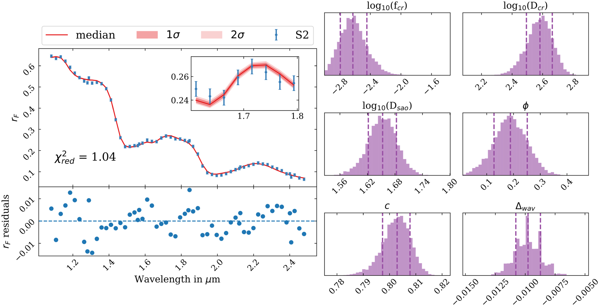

.. FROSTIE documentation master file, created by
   sphinx-quickstart on Mon Jun 27 15:04:18 2022.
   You can adapt this file completely to your liking, but it should at least
   contain the root `toctree` directive.

Welcome to FROSTIE's documentation!
===================================

FROSTIE is spectroscopic retrieval package, written in Python, for analyzing reflectance spectra of planetary surfaces. 'Spectroscopic retrieval' involves analyzing spectroscopic data from planetary surfaces and atmospheres using appropriate physical models and statistical tools. The goal is to infer properties like composition, temperature, etc. of the planetary body being observed. These methods can also be applied to simulated data from future missions/observatories, to help assess their science output and inform their design.

        An example figure from `Mishra et al. (2021) <10.1016/j.icarus.2020.114215>`_ showing FROSTIE's outputs for a model-fitting exercise.

While FROSTIE has been only applied to data of Europa so far, with the right input files (i.e., optical constants of species of interest) it can be readily used to study any planetary surface in the solar system. FROSTIE's features currently include:

* Forward modelling of reflectance spectra using the popular Hapke bi-directional reflectance model `(Hapke (1981) <https://agupubs.onlinelibrary.wiley.com/doi/abs/10.1029/JB086iB04p03039>`_).
* Support for one component or multi-component model using parameters like abundance, grain-size, and porosity.
* A Bayesian inference framework that uses the forward model to find the best model (i.e., the best set of species among the candidates) and derive probability distributions of parameters. 
* Plotting routines to instantly produce publication quality plots
* An interactive widget that allows the user to play with the forward model using sliders and buttons to change parameters.

.. toctree::
   :maxdepth: 1
   :hidden:

   content/installation

.. toctree::
   :maxdepth: 2
   :caption: Guide:
   
   content/notebooks/one_component_model
   content/notebooks/multi_component_model
   content/notebooks/retrieval
..   content/notebooks/interactive_model
   
.. toctree::
   :maxdepth: 2
   :caption: Code Documentation:
   
   autoapi/index
   content/citations
   content/contributing
   

License:
------------------------------------

Copyright 2025 Ishan Mishra

FROSTIE is available under the MIT License.

Logo design by Carly Snell.

