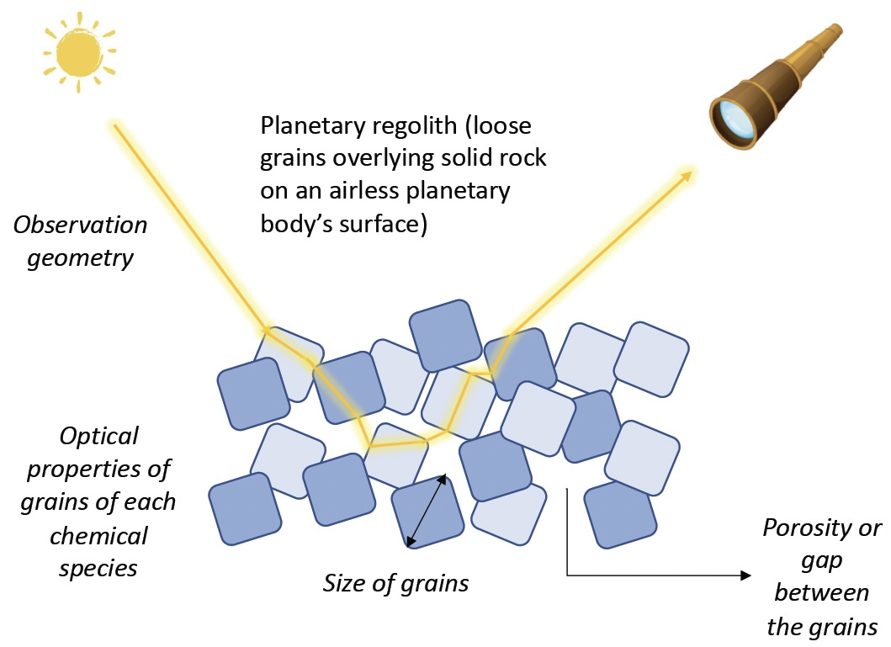

---
title: '`FROSTIE`: A Python Package for Analysis of Reflectance Spectroscopy of Airless Planetary Surfaces'
tags:
  - Python
  - planetary astronomy
  - planetary science
  - spectroscopy
  - Bayesian inference
authors:
  - name: Ishan Mishra
    orcid: 0000-0001-6092-7674
    affiliation: "1"
affiliations:
  - name: Jet Propulsion Laboratory, California Institute of Technology, 4800 Oak Grove Drive, Pasadena, CA 91109
    index: 1
date: 04 April  2025
bibliography: paper.bib
--- 

# Summary
Reflectance spectroscopy is one of the most powerful remote sensing tools in planetary science. By measuring how sunlight reflects off an airless planetary surface across different wavelengths, scientists can identify surface compositions, constrain physical properties such as grain size and porosity, and investigate processes like radiation weathering. However, the extraction of quantitative information from reflectance spectra is complicated by the presence of strong degeneracies between these parameters (see \autoref{fig:reflectance_schematic}).

{width=75%}

`FROSTIE` is an open-source Python package designed to address this challenge. It combines analytical radiative transfer modeling with modern Bayesian inference techniques, enabling robust and reproducible analysis of reflectance spectra. Specifically, `FROSTIE` provides tools to (1) forward model the reflectance spectrum of planetary regoliths using Hapke theory, and (2) perform statistical retrievals to infer best-fit parameters and their uncertainties. This approach is particularly useful in dealing with picking out weak signals in spectroscopic data, such as of trace molecules like organics.

`FROSTIE` is written in Python, with a modular design and comprehensive documentation to make it accessible for students and researchers alike. By adopting a Bayesian framework, `FROSTIE` facilitates parameter estimation, model comparison, and exploration of degeneracies, offering an intuitive and rigorous way to interpret spectral data.

# Statement of Need

The Hapke model [@hapke_bidirectional_1981; @hapke_theory_2012] is a widely used analytical framework for simulating reflectance from particulate surfaces, and has been applied in planetary science for decades [@helfenstein_photometric_1987; @mcewen_photometric_1991; @poulet_comparison_2002; @ciarniello_hapke_2011; @fernando_martian_2016; @protopapa_plutos_2017; @mishra_bayesian_2021_alt; @mishra_comprehensive_2021_alt; @fornasier_phobos_2024]. However, due its complicated nature and numerous parameters, most published studies have used simplified approaches to extract its parameters from data—often relying on grid searches or manual tuning to find best-fit solutions. These methods explore a limited volume of the model's parameter space and do not easily provide uncertainty estimates, or evaluate the statistical significance of detected components.

Bayesian methods offer a natural solution to this problem and have a long-standing history in planetary science subfields such as geophysics and atmospheric remote sensing. Despite this, their application to surface reflectance spectroscopy has been limited. Recent studies [e.g., @belgacem_regional_2020;@lapotre_probabilistic_2017;  @mishra_bayesian_2021_alt; @mishra_comprehensive_2021_alt] have begun to demonstrate the advantages of probabilistic approaches for reflectance analysis, but no widely adopted, open-source software package has existed to implement these techniques—until now.

`FROSTIE` fills this gap by integrating Hapke forward modeling with nested sampling using the dynesty package [@speagle_dynesty_2020], enabling rigorous parameter estimation and model comparison. This makes it uniquely suited for analyzing complex surface mixtures, and especially helpful when working with limited or noisy data.

While legacy tools like [`Tetracorder`](https://github.com/PSI-edu/spectroscopy-tetracorder) [@clark_imaging_2024] offer comprehensive spectral modeling capabilities, they are written in C and Fortran and lack a built-in retrieval framework. `FROSTIE` aims to provide a lightweight, flexible, and Pythonic alternative for modern planetary spectroscopy research.

# Reflectance spectroscopic modelling and retrieval using `FROSTIE`

At its core, `FROSTIE` simulates reflectance spectra based on user-specified surface parameters (e.g., abundances, grain sizes, porosity) and a set of optical constants. The model spectrum is convolved with instrumental response functions, allowing for direct comparison to observed data. The retrieval module employs a nested sampling algorithm to explore parameter space [@speagle_dynesty_2020], construct posterior distributions, and compute the Bayesian evidence. A schematic of the architecture of `FROSTIE` is presented in \autoref{fig:frostie_schematic}.

![The architecture of `FROSTIE`. This schematic is inspired from POSEIDON [@macdonald_hd_2017; @macdonald_poseidon_2023] \label{fig:frostie_schematic}](figures/frostie_schematic.png){width=75%}

Bayesian evidence is a particularly powerful feature that enables users to test the necessity of including specific components in a spectral model [@macdonald_hd_2017; @mishra_bayesian_2021_alt]. For instance, if adding a candidate species improves the Bayesian evidence, this can be interpreted as quantitative support for its detection. This statistical rigor surpasses traditional methods that rely on reduced chi-squared or arbitrary thresholds. 

`FROSTIE` has been described in detail in published works, which also validate the framework using synthetic and laboratory spectra [@mishra_comprehensive_2021_alt; @mishra_bayesian_2021_alt]. These studies applied `FROSTIE` to near-infrared datasets of Europa from the Galileo and Juno missions, modeling mixtures of water ice, sulfuric acid hydrates, CO$_2$, and SO$_2$. The Bayesian framework enabled quantitative constraints on surface composition, physical parameters like porosity, and statistical confidence in the presence of each species. More recently, `FROSTIE` has been used to simulate Europa Clipper observations and assess its ability to detect trace organic compounds via Bayesian model comparison [@mishra_organics_2025]. These examples highlight `FROSTIE`’s flexibility and scientific utility for planetary surface spectroscopy.

# Future Developments

Future developments for `FROSTIE` aim to expand both its modeling capabilities and accessibility. Planned features include a graphical interface for interactive spectral fitting, support for photometric studies and thermal emission spectroscopy, and implementation of alternative reflectance models [.e.g, @doute_multilayer_1998; @stamnes_disort_2017]. A new module is under development to invert optical constants from reflectance spectra—addressing a major bottleneck in surface modeling due to the limited availability of laboratory data. Additionally, computational efficiency improvements such as JIT compilation and GPU support will be explored, along with cloud-hosted environments to allow users to run analyses without requiring local installation.

# Documentation

Documentation for `FROSTIE`, with step-by-step tutorials illustrating research applications, is available at [https://frostie.readthedocs.io/en/latest/index.html](https://frostie.readthedocs.io/en/latest/index.html). 

# Acknowledgements

`FROSTIE` depends on many open-source Python tools, including NumPy [@harris_array_2020], SciPy [@scipy], matplotlib [@Hunter:2007], Jupyter [@Kluyver:2016aa], dynesty [@speagle_dynesty_2020], and corner [@corner].

The development of `FROSTIE` was supported by NASA’s FINESST program (grant 80NSSC20K1381) and the Europa Clipper Project at JPL. Participation in the [`Code/Astro workshop`](https://github.com/semaphoreP/codeastro) helped motivate the transformation of `FROSTIE` into an open-source tool. The author also thanks Nikole Lewis and Ryan J. MacDonald for their valuable mentorship, and Carly Snell for designing the `FROSTIE` logo.

# References
