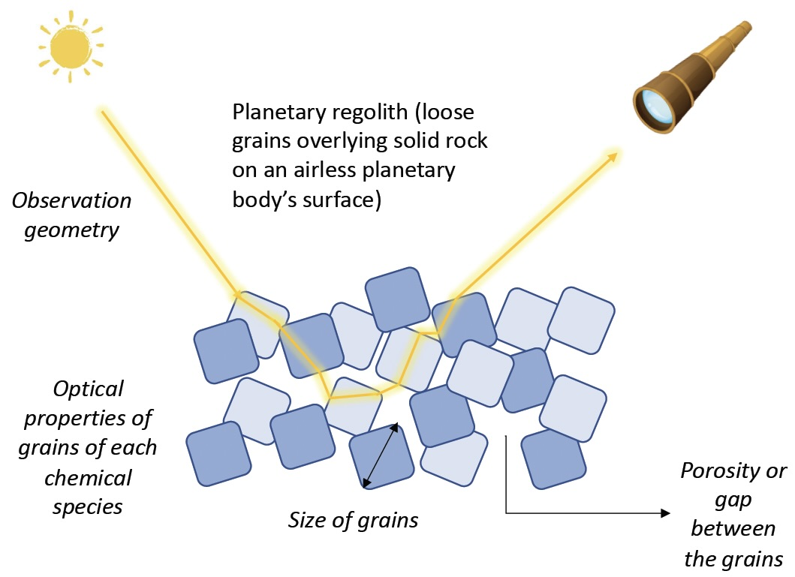

---
title: '`FROSTIE`: A Python Package for Analysis of Reflectance Spectroscopy of Airless Planetary Surfaces'
tags:
  - Python
  - planetary astronomy
  - planetary science
  - spectroscopy
  - Bayesian inference
authors:
  - name: Ishan Mishra
    orcid: 0000-0001-6092-7674
    affiliation: "1, 2"
affiliations:
  - name: Caltech/IPAC, 1200 E California Blvd., MC 100-22, Pasadena, CA 91125, USA
    index: 1
  - name: Jet Propulsion Laboratory, California Institute of Technology, 4800 Oak Grove Drive, Pasadena, CA 91109
    index: 2
date: 04 April  2025
bibliography: paper.bib
--- 

# Summary

<!-- A description of the high-level functionality and purpose of the software for a diverse, non-specialist audience. -->

Reflectance spectroscopy is one of the most powerful remote sensing tools in planetary science. By measuring how sunlight reflects off an airless planetary surface across different wavelengths, scientists can identify surface compositions, constrain physical properties such as grain size and porosity, and investigate processes like radiation weathering. However, the extraction of quantitative information from reflectance spectra is complicated by the presence of strong degeneracies between these parameters (see \autoref{fig:reflectance_schematic}).

{width=75%}

`FROSTIE` is an open-source Python package designed to address this challenge. It combines analytical radiative transfer modeling with modern Bayesian inference techniques, enabling robust and reproducible analysis of reflectance spectra. Specifically, `FROSTIE` provides tools to (1) forward model the reflectance spectrum of planetary regoliths using Hapke theory, and (2) perform statistical retrievals to infer best-fit parameters and their uncertainties. This approach is particularly useful in dealing with picking out weak signals in spectroscopic data, such as of trace molecules like organics.

`FROSTIE` is written in Python, with a modular design and comprehensive documentation to make it accessible for students and researchers alike. By adopting a Bayesian framework, `FROSTIE` facilitates parameter estimation, model comparison, and exploration of degeneracies, offering an intuitive and rigorous way to interpret spectral data.

# Statement of need

<!-- A section that clearly illustrates the research purpose of the software and places it in the context of related work. This should clearly state what problems the software is designed to solve, who the target audience is, and its relation to other work. -->

The Hapke model [@hapke_bidirectional_1981; @hapke_theory_2012] is a widely used analytical framework for simulating reflectance from particulate surfaces, and has been applied in planetary science for decades [@helfenstein_photometric_1987; @mcewen_photometric_1991; @poulet_comparison_2002; @ciarniello_hapke_2011; @fernando_martian_2016; @protopapa_plutos_2017; @mishra_bayesian_2021_alt; @mishra_comprehensive_2021_alt; @fornasier_phobos_2024]. However, due its complicated nature and numerous parameters, most published studies have used simplified approaches to extract its parameters from data—often relying on grid searches or manual tuning to find best-fit solutions. These methods explore a limited volume of the model's parameter space and do not easily provide uncertainty estimates, or evaluate the statistical significance of detected components.

Bayesian methods offer a natural solution to this problem and have a long-standing history in planetary science subfields such as geophysics and atmospheric remote sensing. Despite this, their application to surface reflectance spectroscopy has been limited. Recent studies [e.g., @belgacem_regional_2020;@lapotre_probabilistic_2017;  @mishra_bayesian_2021_alt; @mishra_comprehensive_2021_alt] have begun to demonstrate the advantages of probabilistic approaches for reflectance analysis, but no widely adopted, open-source software package has existed to implement these techniques—until now.

`FROSTIE` fills this gap by integrating Hapke forward modeling with nested sampling using the dynesty package [@speagle_dynesty_2020], enabling rigorous parameter estimation and model comparison. This makes it uniquely suited for analyzing complex surface mixtures, and especially helpful when working with limited or noisy data.

# State of the field

<!-- A description of how this software compares to other commonly-used packages in the research area. If related tools exist, provide a clear “build vs. contribute” justification explaining your unique scholarly contribution and why existing alternatives are insufficient. -->

Historically, spectral analysis of planetary surfaces has relied on "expert systems" such as [`Tetracorder`](https://github.com/PSI-edu/spectroscopy-tetracorder) [@clark_imaging_2024], which identify materials through spectral feature fitting and heuristic rules. While powerful for mapping, these legacy tools are primarily written in C and Fortran, have a steep learning curve, and do not provide a framework for statistical uncertainty quantification. 

In contrast, `FROSTIE` adopts a Bayesian inference approach, utilizing a nested sampling algorithm to invert observed spectra into physical surface parameters like grain size and chemical abundance. This shifts the focus from simple identification to rigorous parameter estimation.

Furthermore, while the exoplanet and planetary atmosphere communities have standardized around open-source Bayesian tools like `TauREx` [@taurex_comparison_2022] and `PLATON` [@zhang_forward_2018], the surface spectroscopy community has largely relied on in-house scripts. `FROSTIE` fills this gap by providing a Pythonic, modular, and reproducible framework. By leveraging modern standards like Jupyter notebooks for tutorials and the broader Python scientific ecosystem, `FROSTIE` lowers the barrier to entry for researchers and students alike.

# Software design

<!-- An explanation of the trade-offs you weighed, the design/architecture you chose, and why it matters for your research application. This should demonstrate meaningful design thinking beyond a superficial code structure description. -->

At its core, `FROSTIE` simulates reflectance spectra based on user-specified surface parameters (e.g., abundances, grain sizes, porosity) and a set of optical constants. The model spectrum is convolved with instrumental response functions, allowing for direct comparison to observed data. The retrieval module employs a nested sampling algorithm to explore parameter space [@speagle_dynesty_2020], construct posterior distributions, and compute the Bayesian evidence. A schematic of the architecture of `FROSTIE` is presented in \autoref{fig:frostie_schematic}.

![The architecture of `FROSTIE`. This schematic is inspired from `POSEIDON` [@macdonald_hd_2017; @macdonald_poseidon_2023] \label{fig:frostie_schematic}](figures/frostie_schematic.png){ width=75% }

Bayesian evidence is a particularly powerful feature that enables users to test the necessity of including specific components in a spectral model [@macdonald_hd_2017; @mishra_bayesian_2021_alt]. For instance, if adding a candidate species improves the Bayesian evidence, this can be interpreted as quantitative support for its detection. This statistical rigor surpasses traditional methods that rely on reduced chi-squared or arbitrary thresholds. 

A key design decision was to prioritize a tutorial-first approach, where the high-level API was finalized through the development of user-facing tutorials before the back-end implementation. We opted for an Object-Oriented Programming (OOP) architecture to ensure that every aspect of a retrieval—from the physical priors and input data to the resulting posterior distributions—is encapsulated within a single instance of a retrieval class. This approach facilitates reproducibility and data provenance, as the entire state of an experiment can be easily serialized and shared. A class-based structure also provides the modularity required to swap different forward models or sampling algorithms. Future iterations of `FROSTIE` that incorporate more complex versions of the Hapke model may require performance optimization (e.g., using JIT compilation).

# Research impact statement

<!-- Evidence of realized impact (publications, external use, integrations) or credible near-term significance (benchmarks, reproducible materials, community-readiness signals). The evidence should be compelling and specific, not aspirational. -->

`FROSTIE` has been described in detail in published works, which also validate the framework using synthetic and laboratory spectra [@mishra_comprehensive_2021_alt; @mishra_bayesian_2021_alt]. These studies applied `FROSTIE` to near-infrared datasets of Europa from the Galileo and Juno missions, modeling mixtures of water ice, sulfuric acid hydrates, CO$_2$, and SO$_2$. The Bayesian framework enabled quantitative constraints on surface composition, physical parameters like porosity, and statistical confidence in the presence of each species. More recently, `FROSTIE` has been used to simulate observations  for the Mapping Imaging Spectrometer for Europa (MISE) instrument on NASA’s Europa Clipper mission, and assess its ability to detect trace organic compounds via Bayesian model comparison [@mishra_organics_2025]. These examples highlight `FROSTIE`’s flexibility and scientific utility for planetary surface spectroscopy. Furthermore, `FROSTIE` is currently being integrated into the official analysis toolkit for the MISE team. This integration ensures the framework will play a central role in the science team’s systematic interpretation of the high quality Europa spectra when we get the data in the early 2030s.

# Future Developments

Future developments for `FROSTIE` aim to expand both its modeling capabilities and accessibility. Planned features include a graphical interface for interactive spectral fitting, support for photometric studies and thermal emission spectroscopy, and implementation of alternative reflectance models [.e.g, @doute_multilayer_1998; @stamnes_disort_2017]. A new module is under development to invert optical constants from reflectance spectra, addressing a major bottleneck in surface modeling due to the limited availability of laboratory data. Additionally, computational efficiency improvements such as JIT compilation and GPU support will be explored, along with cloud-hosted environments (such as Google Collab) to allow users to run analyses without requiring local installation.

# Documentation

Documentation for `FROSTIE`, with step-by-step tutorials illustrating research applications, is available at [https://frostie.readthedocs.io/en/latest/index.html](https://frostie.readthedocs.io/en/latest/index.html). 

# AI usage disclosure

<!-- Transparent disclosure of any use of generative AI in the software creation, documentation, or paper authoring. If no AI tools were used, state this explicitly. If AI tools were used, describe how they were used and how the quality and correctness of AI-generated content was verified. -->

Generative AI was utilized in certain places along the development and documentation of `FROSTIE`. Specifically, AI was used to assist in refactoring the core retrieval logic from a procedural script-based architecture into a modular, object-oriented class structure. AI was also employed for grammatical refinement and language editing during the drafting of this paper. 

The quality and correctness of the AI-assisted code were verified through a the unit tests and the development of a comprehensive retrieval tutorial (available in the documentation). The retrieval tutorial specifically demonstrates that the refactored framework consistently reproduces expected outputs, such as the posterior distributions.

# Acknowledgements

`FROSTIE` depends on many open-source Python tools, including NumPy [@harris_array_2020], SciPy [@scipy], matplotlib [@Hunter:2007], Jupyter [@Kluyver:2016aa], dynesty [@speagle_dynesty_2020], and corner [@corner].

The development of `FROSTIE` was supported by NASA’s FINESST program (grant 80NSSC20K1381) and the Europa Clipper Project at JPL. Participation in the [`Code/Astro workshop`](https://github.com/semaphoreP/codeastro) helped motivate the transformation of `FROSTIE` into an open-source tool. The author also thanks Nikole Lewis and Ryan J. MacDonald for their valuable mentorship, and Carly Snell for designing the `FROSTIE` logo.

# References
